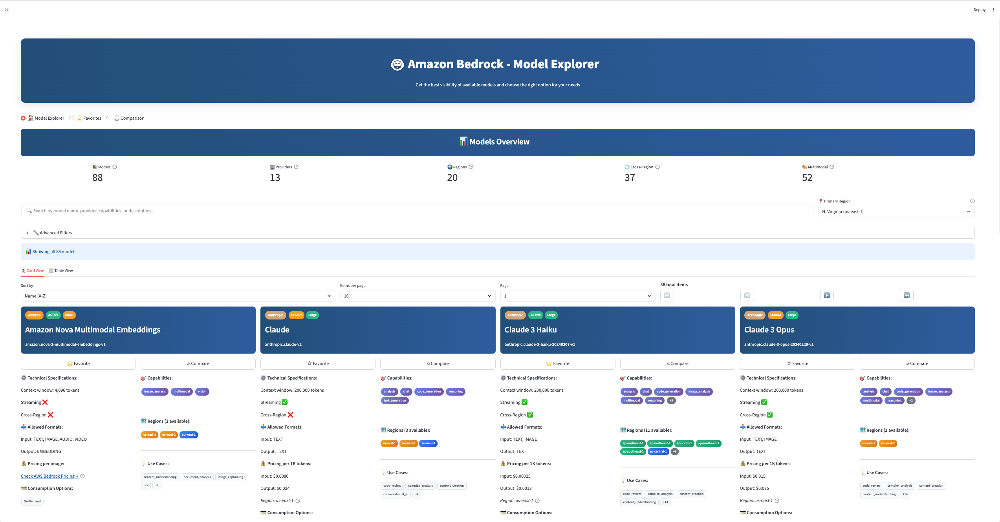
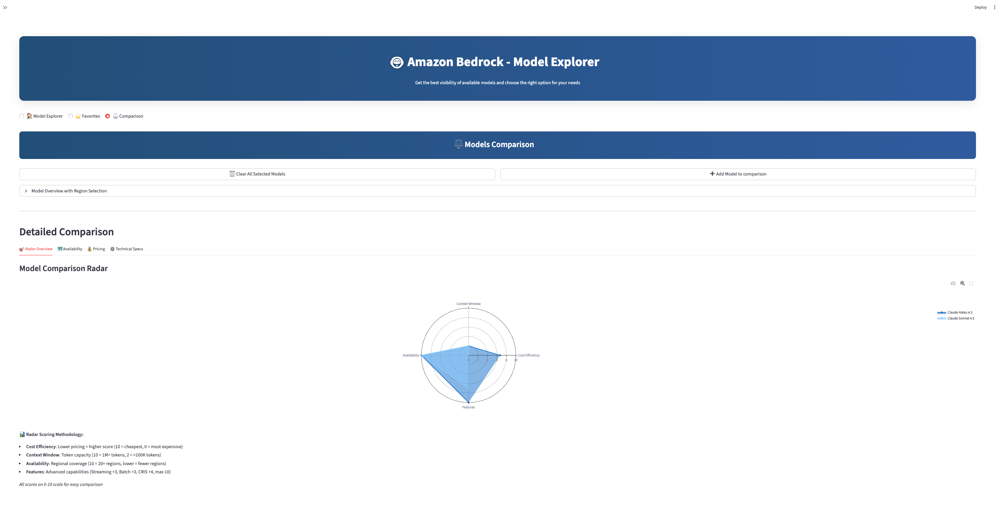
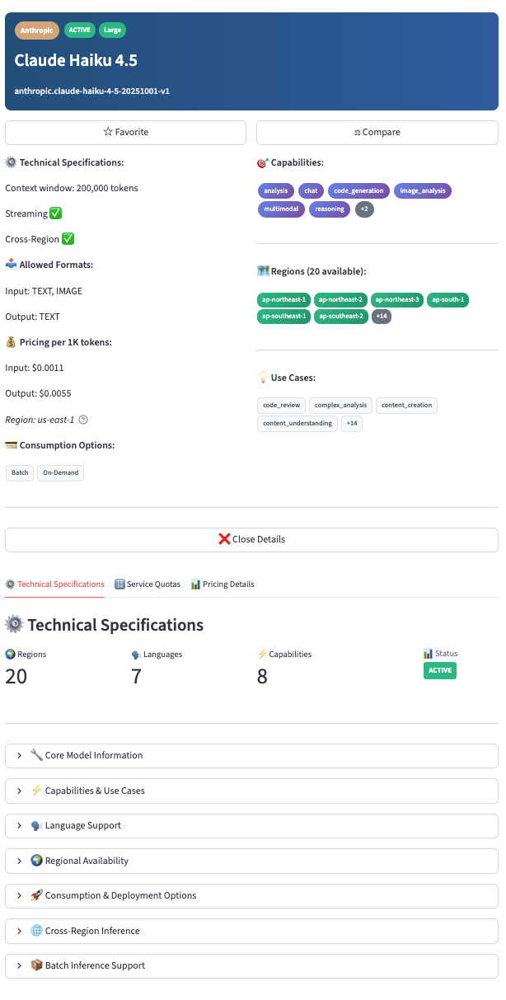
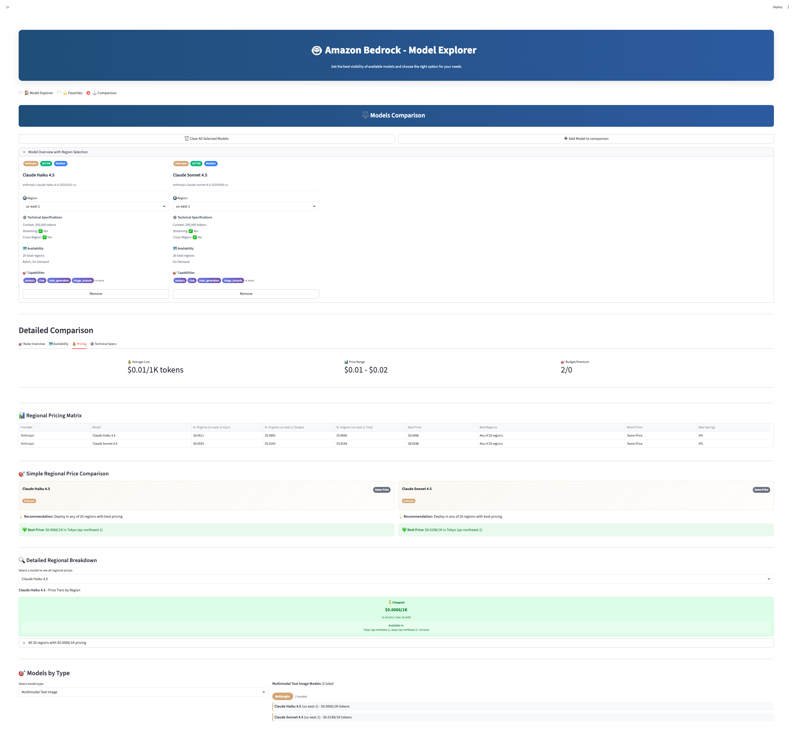
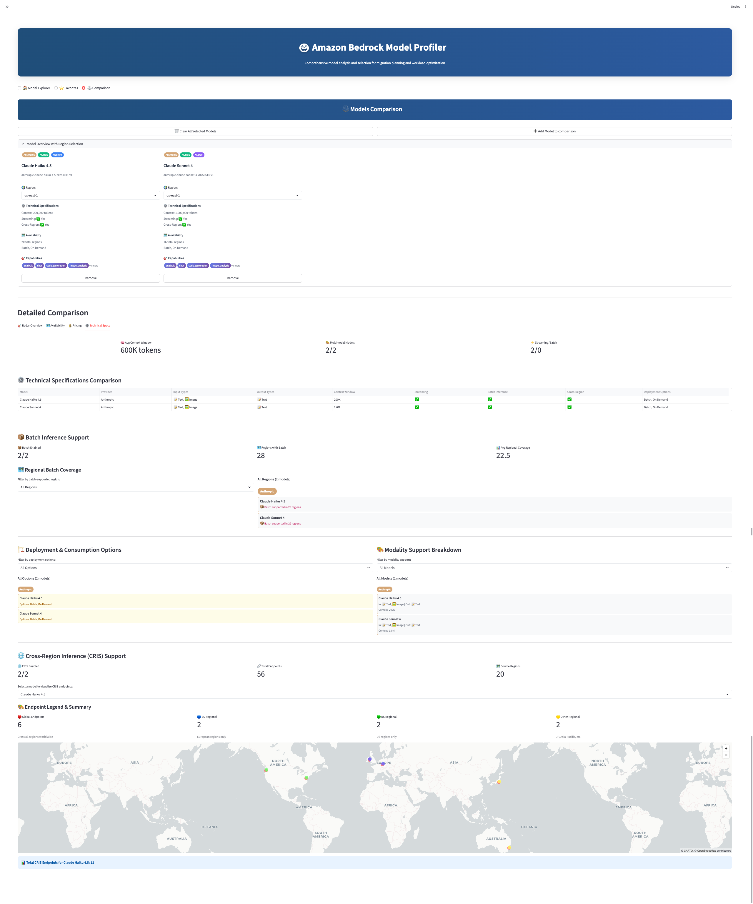

# Amazon Bedrock Model Profiler 🤖

A comprehensive profiling tool for exploring, analyzing, and comparing Amazon Bedrock foundation models to make informed model selection decisions. Whether you're building new applications, optimizing existing workloads, or migrating from other AI services or internal models, this tool provides deep insights into model capabilities, pricing, and regional availability to guide your choice of Amazon Bedrock foundation models.

> **Part of:** [AWS Bedrock Migration and Modernization Tools](https://github.com/aws-samples/sample-bedrock-migration-and-modernization-tools) - A collection of migration tools and samples for Amazon Bedrock adoption.



## Use Cases This Tool Supports

* 🎯 **Model Selection Decisions** - Compare capabilities, specifications, and performance characteristics across Amazon Bedrock foundation models
* 🔄 **Migration Planning** - Evaluate and select the right Amazon Bedrock models when migrating workloads or modernizing AI applications
* 🌍 **Regional Availability Analysis** - Review model availability across AWS regions to plan deployments and ensure service coverage
* 💰 **Cost Optimization** - Compare pricing across models and consumption options (on-demand, provisioned throughput, batch inference) for budget planning
* ⚖️ **Capability Matching** - Find models that match specific requirements for context windows, multimodal capabilities, or specialized tasks
* 📊 **Performance Planning** - Analyze throughput options, latency characteristics, and scaling capabilities for workload requirements
* 🔍 **Comprehensive Model Discovery** - Explore the complete Amazon Bedrock model catalog with detailed specifications and real-time availability



## Getting Started with this Tool

### 1. Clone the repository
```bash
git clone https://github.com/aws-samples/sample-bedrock-migration-and-modernization-tools.git
cd sample-bedrock-migration-and-modernization-tools/bedrock-model-profiler
```

### 2. Set your AWS region
Edit `config.py`:
```python
AWS_DEFAULT_REGION = "us-east-1"  # Your preferred region
```

### 3. Launch it
```bash
python3 launch.py
```

### 4. First-time setup
1. Open `http://localhost:8501` in your browser
2. In the sidebar, go to "⚙️ AWS Setup & Update"
3. Select your AWS profile and click "🔄 Update models database"
4. Wait for data collection (shows progress)

### 5. Start exploring!
- Browse models in different views (cards/table)
- Use filters to find what you need
- Click models for detailed specs and pricing
- Select models to compare them
- Save interesting ones to favorites

## Key Tool Capabilities

### 🔍 Model Discovery and Exploration
This tool provides comprehensive model browsing capabilities:
- Dynamic filtering by provider, capabilities, and regions
- Search functionality across model attributes
- Flexible display patterns (card and table views)
- Drill-down interfaces for detailed specifications

### ⚖️ Model Comparison Framework
The tool implements advanced model comparison features:
- Visual comparison charts using radar plots
- Regional availability visualizations
- Pricing analysis dashboards
- Side-by-side technical specification displays



### 💰 Pricing Integration Features
The tool provides comprehensive pricing analysis capabilities:
- Real-time data integration from AWS Pricing APIs
- Regional price variation analysis and visualization
- Cost estimation calculators
- Regional cost optimization recommendations

### 🌍 Regional Analysis Features
The tool offers multi-region model analysis capabilities:
- Model availability mapping across AWS regions
- Regional availability comparisons
- Cross-region inference capability integration
- Service quota analysis and display by region

## What You Need

**System Requirements:**
- Python 3.8+
- Web browser
- Internet connection

**AWS Requirements:**
- AWS account with credentials configured
- Required permissions:
  - **Bedrock:** `bedrock:ListFoundationModels`, `bedrock:GetFoundationModel`, `bedrock:ListInferenceProfiles`
  - **Pricing API:** `pricing:GetProducts`, `pricing:DescribeServices`, `pricing:GetAttributeValues`
  - **Service Quotas:** `servicequotas:ListServiceQuotas`, `servicequotas:GetServiceQuota`

**External Data Sources:**
- **[LiteLLM](https://github.com/BerriAI/litellm):** Primary source for context window and max output token specifications (234+ Bedrock-compatible models)

## Troubleshooting

**No models showing?**
→ Run data collection first: "🔄 Update models database"

**Access denied errors?**
→ Check your AWS permissions for Bedrock and Pricing APIs

**App won't start?**
→ Make sure you have Python 3.8+ and try `python3 launch.py`

## Additional Screenshots

### Pricing Analysis


### Technical Specifications


---

## Important Notes

**This is a migration tool for learning and reference purposes.** It provides comprehensive model profiling and selection capabilities to help you understand implementation approaches, but should be reviewed and adapted for your specific production migration requirements.

**For production migration decisions:**
- Always verify pricing and availability in the AWS console and official AWS documentation
- Contact your AWS account team for guidance on model selection and migration planning for production workloads
- Review and adapt the code according to your specific security, compliance, and migration requirements
- Consider implementing proper error handling, logging, and monitoring for production migration workflows
- Test thoroughly with your specific use cases and data during migration planning

**Data accuracy:** While this tool uses official AWS APIs, model availability and pricing can change. Always verify current information through official AWS channels before making final migration decisions.

## Contributing

We welcome contributions! Please see [CONTRIBUTING.md](../CONTRIBUTING.md) for guidelines.

## License

This code is licensed under the MIT-0 License. See the [LICENSE](../LICENSE) file for details.