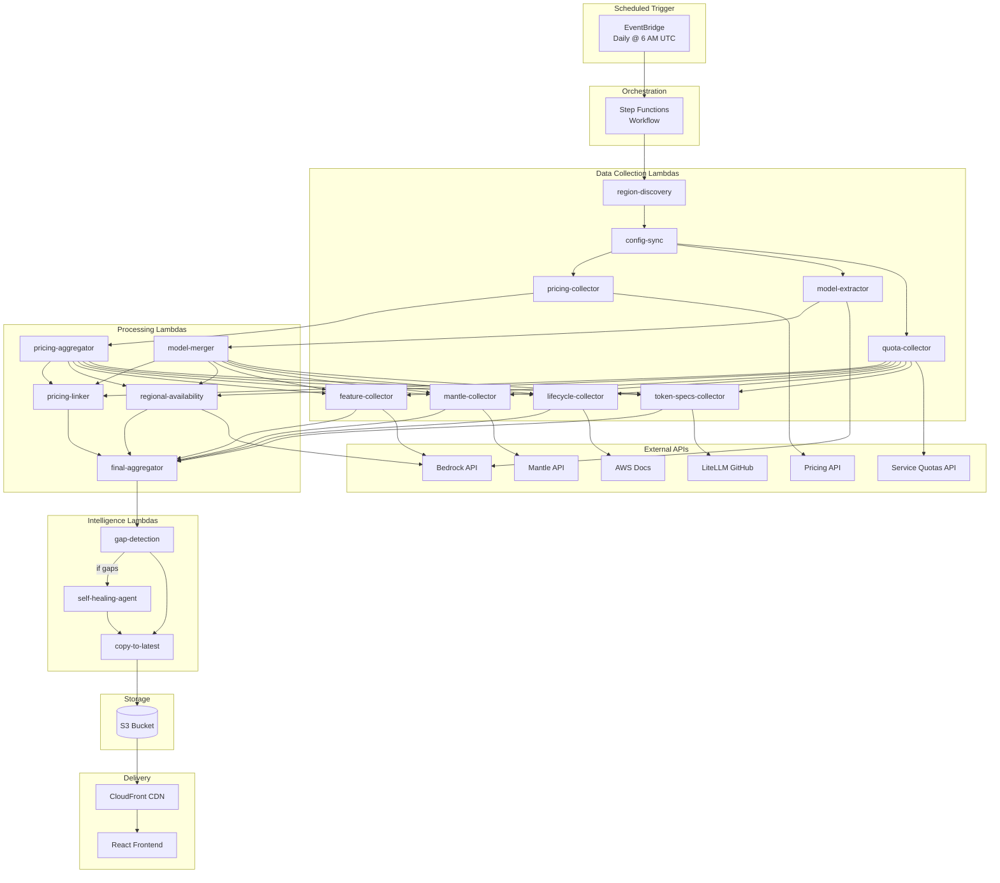
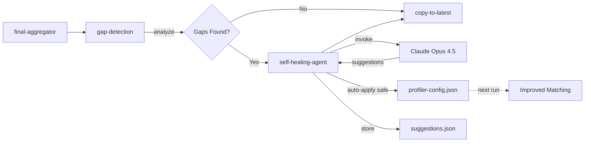

# Bedrock Model Profiler - Architecture

> **Version:** 1.0  
> **Last Updated:** March 2026  
> **Status:** Production  
> **Live URL:** https://d3oem6l61p8j11.cloudfront.net

This document is the **single source of truth** for understanding the Bedrock Model Profiler architecture.

---

## Table of Contents

1. [System Overview](#system-overview)
2. [Data Flow](#data-flow)
3. [External APIs & Data Sources](#external-apis--data-sources)
4. [Efficiency Analysis](#efficiency-analysis)
5. [Configuration](#configuration)
6. [Self-Healing System](#self-healing-system)
7. [Deployment](#deployment)

---

## System Overview

### High-Level Architecture



### Component Inventory

| Component Type | Count | Purpose |
|----------------|-------|---------|
| Lambda Functions | 17 | Data collection, processing, intelligence |
| Step Functions | 1 | Workflow orchestration |
| S3 Buckets | 1 | Data storage |
| CloudFront Distributions | 1 | CDN delivery |
| EventBridge Rules | 1 | Daily trigger |
| Lambda Layers | 1 | Shared utilities |
| Cognito User Pool | 1 | Authentication |

### Technology Stack

| Layer | Technology |
|-------|------------|
| **Frontend** | React 18, Vite, Tailwind CSS, Radix UI, Zustand |
| **Backend** | Python 3.12, AWS Lambda, Step Functions |
| **Infrastructure** | AWS SAM, CloudFormation |
| **Data Storage** | S3 (JSON files) |
| **CDN** | CloudFront |
| **Auth** | Cognito OIDC |
| **AI/ML** | Bedrock Claude Opus 4.5 (self-healing) |
| **Observability** | Lambda Powertools, CloudWatch |

---

## Data Flow

### Complete Pipeline Flow

```
┌─────────────────────────────────────────────────────────────────────────────────┐
│                              EXECUTION PHASES                                    │
└─────────────────────────────────────────────────────────────────────────────────┘

PHASE 0: INITIALIZATION
  ┌──────────────────┐     ┌──────────────────┐     ┌──────────────────┐
  │ DiscoverRegions  │ ──► │ InitializeExec   │ ──► │   ConfigSync     │
  │ (dynamic regions)│     │ (set up paths)   │     │ (frontend config)│
  └──────────────────┘     └──────────────────┘     └──────────────────┘

PHASE 1: PARALLEL COLLECTION (Wave 1)
  ┌─────────────────────────────────────────────────────────────────────────────┐
  │                                                                             │
  │  ┌─────────────────┐    ┌─────────────────┐    ┌─────────────────┐         │
  │  │ pricing-collector│   │ model-extractor │    │ quota-collector │         │
  │  │   (×3 parallel)  │   │  (×2 regions)   │    │  (×16 regions)  │         │
  │  └────────┬─────────┘   └────────┬────────┘    └────────┬────────┘         │
  │           │                      │                      │                   │
  │           ▼                      ▼                      │                   │
  │  ┌─────────────────┐    ┌─────────────────┐             │                   │
  │  │pricing-aggregator│   │  model-merger   │             │                   │
  │  │ + cache write    │   │ + cache keys    │             │                   │
  │  └────────┬─────────┘   └────────┬────────┘             │                   │
  │           │                      │                      │                   │
  └───────────┼──────────────────────┼──────────────────────┼───────────────────┘
              │                      │                      │
              └──────────────────────┼──────────────────────┘
                                     ▼

PHASE 2: ENRICHMENT (Wave 2)
  ┌─────────────────────────────────────────────────────────────────────────────┐
  │  ┌─────────────┐  ┌───────────────┐  ┌─────────────┐  ┌─────────────────┐  │
  │  │pricing-linker│  │regional-avail │  │feature-coll │  │token-specs-coll │  │
  │  │             │  │(uses cache)   │  │ (×N regions)│  │(LiteLLM fetch)  │  │
  │  └─────────────┘  └───────────────┘  └─────────────┘  └─────────────────┘  │
  │                                                                             │
  │  ┌─────────────────┐  ┌─────────────────┐                                  │
  │  │ mantle-collector│  │lifecycle-collect│                                  │
  │  │  (×N regions)   │  │  (web scrape)   │                                  │
  │  └─────────────────┘  └─────────────────┘                                  │
  └─────────────────────────────────────────────────────────────────────────────┘
                                     │
                                     ▼

PHASE 3: AGGREGATION & INTELLIGENCE
  ┌──────────────────┐     ┌──────────────────┐     ┌──────────────────┐
  │ final-aggregator │ ──► │  gap-detection   │ ──► │self-healing-agent│
  │ (merge all data) │     │ (analyze gaps)   │     │  (if triggered)  │
  └──────────────────┘     └──────────────────┘     └────────┬─────────┘
                                                             │
                                     ┌───────────────────────┘
                                     ▼
PHASE 4: PUBLICATION
  ┌──────────────────┐     ┌──────────────────┐     ┌──────────────────┐
  │  copy-to-latest  │ ──► │    CloudFront    │ ──► │  React Frontend  │
  │  (S3 copy)       │     │   (cache/serve)  │     │   (display)      │
  └──────────────────┘     └──────────────────┘     └──────────────────┘
```

### Data Transformations

| Stage | Input | Transformation | Output |
|-------|-------|----------------|--------|
| `pricing-collector` | Pricing API pages | Extract & normalize | Raw pricing JSON |
| `pricing-aggregator` | 3 pricing files | Dedupe, categorize | Merged pricing |
| `model-extractor` | Bedrock API | Add console metadata | Enriched models |
| `model-merger` | 2 region files | Dedupe, merge metadata | Unified model list |
| `pricing-linker` | Models + Pricing | Fuzzy match (>0.7) | Models with pricing refs |
| `regional-availability` | 27 regions API | Filter ON_DEMAND/PROVISIONED | Availability map |
| `final-aggregator` | All enrichments | Merge into final schema | Production-ready JSON |

### S3 File Structure

```
bucket/
├── latest/                              # Production files (served via CloudFront)
│   ├── bedrock_models.json             # Complete model catalog (~2-3 MB)
│   └── bedrock_pricing.json            # Pricing by provider/model (~1-2 MB)
│
├── config/                              # Configuration files
│   ├── profiler-config.json            # Backend configuration
│   ├── frontend-config.json            # Generated frontend config
│   ├── generated-constants.js          # Optional JS constants
│   └── config-history/                 # Config backups from auto-updates
│       └── profiler-config.{timestamp}.json
│
├── executions/{execution-id}/           # Per-execution data (retained for debugging)
│   ├── pricing/                         # Raw pricing data
│   │   ├── AmazonBedrock.json
│   │   ├── AmazonBedrockService.json
│   │   └── AmazonBedrockFoundationModels.json
│   ├── models/                          # Per-region model data
│   │   ├── us-east-1.json
│   │   └── us-west-2.json
│   ├── cache/                           # Cached API responses for reuse
│   │   ├── list_foundation_models_us-east-1.json
│   │   └── list_foundation_models_us-west-2.json
│   ├── quotas/{region}.json             # Service quotas
│   ├── features/{region}.json           # Inference profiles
│   ├── mantle/{region}.json             # Mantle models
│   ├── lifecycle/lifecycle.json         # Model lifecycle data
│   ├── merged/
│   │   ├── pricing.json
│   │   └── models.json
│   ├── intermediate/
│   │   ├── models-with-pricing.json
│   │   ├── regional-availability.json
│   │   └── token-specs.json
│   └── final/
│       ├── bedrock_models.json
│       └── bedrock_pricing.json
│
└── agent/                               # Self-healing agent data
    ├── gap-reports/{execution-id}/
    │   └── gap-analysis.json
    └── suggestions/{execution-id}/
        └── suggestions.json
```

---

## External APIs & Data Sources

### Complete API Inventory

| API | Lambda Caller | Calls/Execution | Rate Limited | Caching Status |
|-----|---------------|-----------------|--------------|----------------|
| **AWS Pricing API** | `pricing-collector` | ~300 (paginated × 3 service codes) | Yes (adaptive) | No |
| **Bedrock ListFoundationModels** | `model-extractor` | 2 (us-east-1, us-west-2) | Moderate | **Yes** (→ regional-availability) |
| **Bedrock Console REST API** | `model-extractor` | 2 (SigV4, x-console-consumer) | Low | No |
| **Bedrock ListFoundationModels (filtered)** | `regional-availability` | ~54 (27 regions × 2 filters) | Moderate | **Yes** (reads from cache) |
| **Bedrock ListInferenceProfiles** | `feature-collector` | ~27 (one per region) | Low | No |
| **Bedrock ListInferenceProfiles** | `region-discovery` | ~27 (discovery phase) | Low | No |
| **Mantle API** | `mantle-collector` | ~27 + probes | Low | No |
| **Service Quotas API** | `quota-collector` | ~16 (quota regions) | Moderate | No |
| **LiteLLM GitHub** | `token-specs-collector` | 1 | None | No (public URL) |
| **AWS Docs HTML** | `lifecycle-collector` | 1 | None | No (public URL) |
| **Bedrock InvokeModel** | `self-healing-agent` | 0-1 (conditional) | Yes | No |

### API Rate Limits & Mitigations

| API | Rate Limit | Mitigation Strategy |
|-----|------------|---------------------|
| Pricing API | 10 TPS | Adaptive retry, exponential backoff |
| Bedrock ListFoundationModels | 10 TPS | Caching between Lambdas |
| Service Quotas | 5 TPS | Max concurrency = 10, adaptive retry |
| Bedrock InvokeModel | Model-dependent | Only called when gaps detected |

### Retry Configuration (Step Functions)

```json
{
  "Retry": [
    {
      "ErrorEquals": ["ThrottlingException", "ProvisionedThroughputExceededException"],
      "IntervalSeconds": 10,
      "MaxAttempts": 5,
      "BackoffRate": 2,
      "JitterStrategy": "FULL",
      "MaxDelaySeconds": 120
    }
  ]
}
```

---

## Efficiency Analysis

### Current Optimizations

| Optimization | Implementation | Impact |
|--------------|----------------|--------|
| **Full region model caching** | `model-extractor` runs in all 27 regions, writes to `cache/` | 100% cache coverage for downstream |
| **Inference profile caching** | `region-discovery` → `feature-collector` via S3 cache | Eliminates 27 redundant API calls |
| **TTL-based LiteLLM caching** | 24h cache for external pricing data | Avoids repeated HTTP fetches |
| **TTL-based lifecycle caching** | 24h cache for model lifecycle data | Avoids repeated web scraping |
| **Dynamic region discovery** | No hardcoded regions; discovers at runtime | Auto-adapts to new AWS regions |
| **Parallel collection** | Wave 1: 3 pricing + 27 models + 20 quotas concurrent | ~70% time reduction |
| **Parallel enrichment** | Wave 2: 6 branches concurrent | ~50% time reduction |
| **Adaptive retry** | Exponential backoff with jitter | Prevents cascade failures |

### Known Inefficiencies & Recommendations

| Inefficiency | Current State | Status | Notes |
|--------------|---------------|--------|-------|
| **Regional availability** calls all 27 regions | 54 API calls (ON_DEMAND + PROVISIONED filters) | **FIXED** | Now uses model-extractor cache (0 API calls) |
| **Feature collector** has no caching | 27 API calls to ListInferenceProfiles | **FIXED** | Now reads from region-discovery cache |
| **Lifecycle scraping** re-fetches every run | 1 HTTP request/execution | **FIXED** | TTL-based caching (24h) |
| **LiteLLM pricing** re-fetches every run | 1 HTTP request/execution | **FIXED** | TTL-based caching (24h) |
| **Mantle collector** probes each region | ~54 calls (list + probe × 27) | Open | Batch or cache known-supported models |
| **Config sync** runs every execution | Regenerates frontend config each time | Open | Only regenerate if backend config changed |

### API Call Counts: Before vs After Caching

```
BEFORE CACHING (Hypothetical):
  model-extractor (us-east-1)     →  1 API call
  model-extractor (us-west-2)     →  1 API call
  regional-availability           →  54 API calls (27 × 2 filters)
                                  ────────────────
                                     56 API calls

AFTER FULL CACHING (Current):
  model-extractor (27 regions)    →  27 API calls + 27 cache writes
  regional-availability           →  0 API calls (100% cache hits)
                                  + 27 cache reads
  feature-collector               →  0 API calls (100% cache hits)
                                  + 27 cache reads
  token-specs-collector           →  0-1 API calls (TTL cache)
  lifecycle-collector             →  0-1 API calls (TTL cache)
                                  ────────────────
                                     ~29 API calls + 54 cache reads
```

### Execution Timing

| Phase | Duration | Notes |
|-------|----------|-------|
| Phase 0: Initialization | ~10s | Region discovery + config sync |
| Phase 1: Wave 1 Collection | 3-5 min | Parallel (pricing slowest) |
| Phase 2: Wave 2 Enrichment | 2-3 min | Parallel (regional-avail slowest) |
| Phase 3: Aggregation | 1-2 min | Serial |
| Phase 4: Publication | ~10s | S3 copy |
| **Total** | **8-12 min** | |

---

## Configuration

### profiler-config.json Structure

Located at: `backend/config/profiler-config.json`

```json
{
  "version": "1.0.0",
  "last_updated": "2026-03-03T12:00:00Z",
  
  "external_urls": {
    "pricing": { "bulk_pricing_api": "...", "pricing_api_region": "us-east-1" },
    "documentation": { "bedrock_models_supported": "...", ... },
    "external_data_sources": { "litellm_model_prices": "..." }
  },
  
  "provider_configuration": {
    "provider_aliases": { "mistral ai": ["mistral", "mistralai"], ... },
    "provider_patterns": { "Anthropic": ["claude", "sonnet", "haiku"], ... },
    "explicit_provider_names": { "ai21": "AI21 Labs", ... },
    "provider_colors": { "Amazon": "#FF9900", ... },
    "documentation_links": { "Anthropic": { "aws_bedrock_guide": "..." }, ... }
  },
  
  "region_configuration": {
    "model_regions": ["us-east-1", "us-west-2"],
    "quota_regions": ["us-east-1", ...],  // 16 regions
    "feature_regions": ["us-east-1", ...], // 27 regions
    "region_locations": { "us-east-1": "US East (N. Virginia)", ... },
    "region_coordinates": { "us-east-1": { "lat": 38.95, "lng": -77.45, ... }, ... },
    "aws_regions": [{ "value": "us-east-1", "label": "N. Virginia", "geo": "US" }, ...],
    "geo_region_options": [{ "value": "US", "label": "US Regions" }, ...]
  },
  
  "model_configuration": {
    "model_families": ["claude", "titan", "nova", ...],
    "model_variants": ["haiku", "sonnet", "opus", ...],
    "context_window_specs": {
      "anthropic.claude-3-5-sonnet": { "standard_context": 200000, "max_output": 8192 },
      ...
    },
    "context_window_thresholds": { "small": 32000, "medium": 128000, "large": 500000 }
  },
  
  "matching_configuration": {
    "min_confidence_threshold": 0.7,
    "size_variance_threshold": 0.3,
    "suffixes_to_remove": ["-it", "-instruct", "-chat", ...],
    "type_conflicts": [{ "group1": ["embed"], "group2": ["chat"] }, ...]
  },
  
  "agent_configuration": {
    "bedrock_model_id": "us.anthropic.claude-opus-4-5-20251101-v1:0",
    "max_tokens": 8192,
    "thresholds": { "unmatched_models_trigger": 5, "low_confidence_threshold": 0.6 },
    "auto_apply_rules": { "safe_changes": [...], "requires_review": [...] }
  },
  
  "pricing_service_codes": ["AmazonBedrock", "AmazonBedrockService", "AmazonBedrockFoundationModels"],
  
  "gap_detection_config": {
    "context_window_variance_threshold": 0.1,
    "enable_frontend_drift_detection": true,
    "enable_context_window_detection": true,
    "enable_service_code_detection": true
  }
}
```

### Environment Variables

| Variable | Lambda | Default | Description |
|----------|--------|---------|-------------|
| `LOG_LEVEL` | All | `INFO` | Logging verbosity |
| `AVAILABILITY_MAX_WORKERS` | regional-availability | `10` | Thread pool size |
| `AVAILABILITY_REGION_TIMEOUT` | regional-availability | `30` | Per-region timeout (s) |
| `POWERTOOLS_SERVICE_NAME` | All | `bedrock-profiler` | Observability service name |
| `POWERTOOLS_METRICS_NAMESPACE` | All | `BedrockProfiler` | CloudWatch namespace |

### Frontend Configuration Sync

The `config-sync` Lambda extracts frontend-relevant data from `profiler-config.json`:

```
profiler-config.json                    frontend-config.json
───────────────────                    ───────────────────
provider_configuration.provider_colors  →  providers.colors
region_configuration.region_locations   →  regions
region_configuration.aws_regions        →  aws_regions
region_configuration.geo_region_options →  geo_region_options
model_configuration.context_thresholds  →  model_config.context_thresholds
```

---

## Self-Healing System

### Architecture



### Gap Detection Types

| Gap Type | Detection Logic | Example |
|----------|-----------------|---------|
| **Models without pricing** | `has_pricing == false` | New model without pricing entry |
| **Low confidence matches** | `confidence < 0.6` | Fuzzy match not confident |
| **Unknown providers** | Not in `provider_patterns` | New provider "MiniMax" |
| **New models** | Delta from `latest/bedrock_models.json` | Model added since last run |
| **Context window mismatch** | Config vs API variance > 10% | Claude shows 200K, config has 180K |
| **Unknown service codes** | Not in `pricing_service_codes` | New "AmazonBedrockAgents" code |
| **Frontend config drift** | Backend regions ≠ frontend regions | New region not in frontend |

### Auto-Update Workflow

```
1. gap-detection runs
   ↓
2. If shouldTriggerAgent == true:
   ↓
3. self-healing-agent invokes Claude with:
   - Gap report details
   - Current profiler-config.json
   - Safety rules
   ↓
4. Claude responds with structured suggestions:
   {
     "suggestions": [
       {
         "type": "provider_pattern_addition",
         "target_config_path": "provider_configuration.provider_patterns.NVIDIA",
         "suggested_value": ["nvidia", "nemotron"],
         "auto_apply_safe": true,
         "confidence": 0.95
       }
     ]
   }
   ↓
5. For each suggestion where auto_apply_safe == true:
   - Validate against max_models_affected threshold
   - Apply to profiler-config.json
   - Create backup in config-history/
   ↓
6. Store all suggestions for review
```

### Validation Rules

```python
# Applied before auto-update
def validate_suggestion(suggestion, config):
    # Rule 1: Check affected models ratio
    if affected_ratio > 0.2:  # 20% threshold
        return False, "Affects too many models"
    
    # Rule 2: Type-specific validation
    if suggestion.type == "context_window_update":
        if suggested_value.standard_context <= 0:
            return False, "Invalid context window"
    
    # Rule 3: Must be in safe_changes list
    if suggestion.type not in config.auto_apply_rules.safe_changes:
        return False, "Requires manual review"
    
    return True, "Valid"
```

---

## Deployment

### Stack Names

| Environment | Stack Name | S3 Bucket Pattern |
|-------------|------------|-------------------|
| Development | `bedrock-profiler-dev` | `bedrock-profiler-dev-*` |
| Production | `bedrock-profiler-prod` | `bedrock-profiler-prod-*` |

### Deployment Commands

**Full Backend Deployment:**
```bash
cd infra
sam build -t backend-template.yaml
sam deploy --stack-name bedrock-profiler-dev \
  --capabilities CAPABILITY_NAMED_IAM \
  --resolve-s3
```

**Frontend Deployment:**
```bash
cd frontend
npm run build
./scripts/deploy.sh  # Syncs to S3 + CloudFront invalidation
```

**Infrastructure Setup (First Time):**
```bash
./setup-infrastructure.sh
```

### SAM Templates

| Template | Purpose |
|----------|---------|
| `backend-template.yaml` | Main backend: Lambdas, Step Functions, S3, EventBridge |
| `frontend-template.yaml` | Frontend: S3 bucket, CloudFront, OAC |
| `analytics-template.yaml` | Optional: Analytics Lambda, API Gateway |

### Lambda Layer Versioning

The shared layer (`CommonLayer`) is versioned automatically:

```yaml
CommonLayer:
  Type: AWS::Serverless::LayerVersion
  Properties:
    LayerName: bedrock-profiler-common
    ContentUri: backend/layers/common/
    CompatibleRuntimes:
      - python3.12
```

Layer updates trigger new versions; Lambdas reference `!Ref CommonLayer` to get latest.

### CI/CD Considerations

1. **Backend changes**: Rebuild + redeploy SAM stack
2. **Frontend changes**: `npm run build` + S3 sync + CloudFront invalidation
3. **Config changes**: Edit `profiler-config.json` in S3 (or let self-healing auto-update)
4. **Layer changes**: SAM deploy creates new layer version automatically

---

## Appendix

### Related Documentation

| Document | Description |
|----------|-------------|
| [DATA_SOURCES.md](./DATA_SOURCES.md) | Detailed API documentation and data schemas |
| [CLAUDE.md](../CLAUDE.md) | Development guide for Claude Code |
| [backend/lambdas/README.md](../backend/lambdas/README.md) | Lambda contracts and interfaces |

### Diagram Source (Mermaid)

All Mermaid diagrams can be rendered at https://mermaid.live or in any Mermaid-compatible viewer.

### Changelog

| Date | Change |
|------|--------|
| 2026-03-03 | Initial architecture document |
| 2026-03-03 | Added caching system documentation |
| 2026-03-03 | Added self-healing enhancement details |
