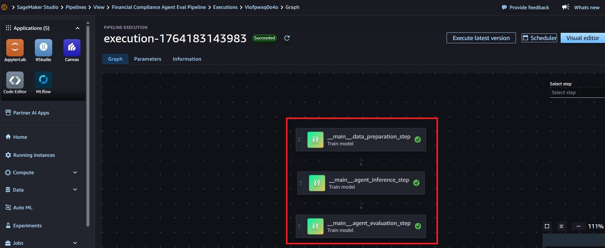
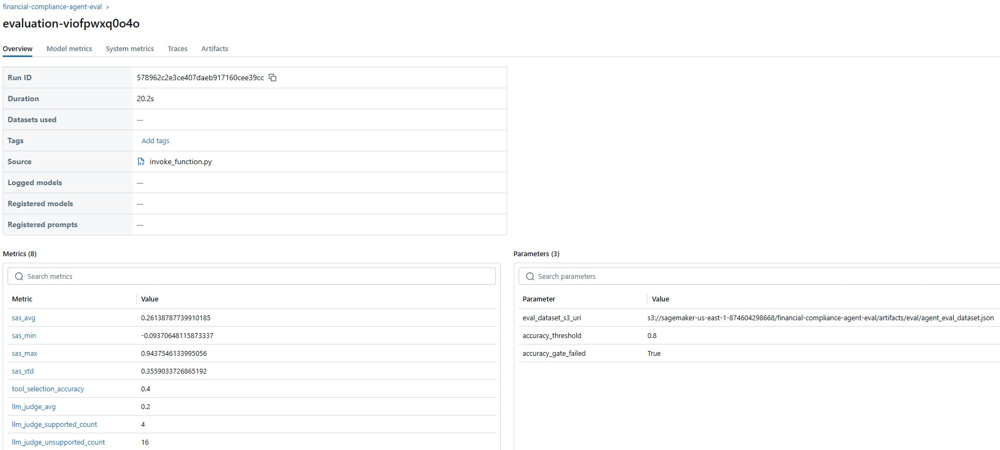

# Financial Compliance AI Agent Pipeline

An end-to-end pipeline for **optimizing and evaluating AI agents** for financial compliance Q&A using **Amazon Bedrock**, **Amazon SageMaker**, **MLflow**, and **Haystack**.

This project takes you from **local experimentation** to a **production-ready agent evaluation pipeline**, with robust metrics and repeatable workflows.

---

## Overview

This project demonstrates a complete workflow for:

1. **Local Development**  
   Build and test a hybrid RAG + Web Search agent locally using Haystack and Chroma.

2. **Scalable Evaluation**  
   Run large-scale, reproducible evaluations using SageMaker Pipelines with MLflow tracking.

3. **Performance Benchmarking**  
   Compare prompts and models using semantic, retrieval, and factuality metrics.

---

## Architecture

The pipeline integrates:

- **Amazon Bedrock**  
  Foundation models 
- **Haystack**  
  Agent with `rag` + `web_search` tools, Chroma vector DB, RAG pipeline  
- **SageMaker Pipelines**  
  Orchestration for data prep, inference, and evaluation  
- **MLflow**  
  Central tracking for metrics, parameters, prompts, models, and artifacts

### Visuals

**SageMaker Pipeline**  


**MLflow**  


**Architecture Diagram**  


---

## Project Structure

```text
├── sm_mlflow_pipe/
│   ├── sm_pipe.ipynb                # SageMaker pipeline orchestration
│   ├── requirements.txt             # Dependencies
├── local_pipe/
│   └── pipe.ipynb                   # Local agent + evaluation notebook
│   └── chat_message_printer.py      # Pretty print chat messages 
├── haystack-intro/
│   └── haystack_intro.ipynb         # Intro to Haystack
│   └── requirements-sagemaker.txt   # Sagemaker requirements
│   └── requirements.txt             # other notebook requirements
└── data/
    ├── AMZN-2023-10k.pdf            # PDF data for RAG
    ├── ground_truth.json            # Ground truth for Agent inference 
    └── create_test_dataset.py       # Script for creating test dataset 
    └── 10k-vec-db                   # Precreated ChromaDB
└── iam_roles/
    ├── sagemaker_iam_policies.json  # IAM Sagemaker permission policies
```

---
## Quick Start

### Prerequisites

AWS account with Bedrock, SageMaker, and S3 access

Python 3.8+

AWS CLI configured

SageMaker Studio domain with execution role


#### 1. IAM Setup

Copy the JSON under iam_roles/sagemaker_iam_policies.json and attach it as an inline policy on your SageMaker execution role.

#### 2. Learn Core Components

Run:

haystack/haystack_intro.ipynb


#### 3. Local Agent Evaluation

Run:

local_pipe/pipe.ipynb

This notebook:

Builds a Chroma vector store over the Amazon 10-K

Creates an agent with rag + web_search tools

Applies rules:

Use RAG for 2023 and earlier

Use Web Search for 2024+ / current

Evaluates the agent against ground_truth.json

Computes semantic similarity, tool selection accuracy, and factuality.

#### 4. Scalable Production Pipeline

Run:

sm_mlflow_pipe/sm_pipe.ipynb

This notebook:

Orchestrates data prep → inference → evaluation

Uses SageMaker Remote Functions for scale

Logs metrics + artifacts to MLflow

---
## Evaluation Metrics

The pipeline evaluates models using four complementary metrics, giving a realistic and multidimensional view of agent quality.

### 1. Semantic Answer Similarity (SAS)

Measures how close the agent’s answer is in meaning to the ground truth, not in exact wording.
Useful because LLMs often paraphrase valid answers.

### 2. Tool Selection Accuracy

Measures whether the agent used the correct tool (rag vs web_search) according to the expected label.

This ensures:

Historical questions use RAG

Current questions use Web Search

Agents follow governance rules and cost boundaries

### 3. LLM-As-A-Judge Factuality Score

A separate LLM evaluates whether the answer is factually supported by the provided context.

This detects:

Hallucinations

Unsupported claims

Incorrect interpretations

Scores are simple:

1 → supported

0 → unsupported

---
## Workflow Summary

### 1. Local Evaluation

Run RAG + Web Search agent locally

Evaluate with SAS, factuality, and tool accuracy

Identify failure patterns early

### 2. SageMaker Pipeline

Moves local evaluation to scalable infrastructure

Includes:

data-preparation

run-inference

evaluate-predictions

Logs metrics to MLflow for comparison across models and prompts

### 3. Optional Conditional Promotion

Only save a prompt/model if thresholds (e.g., accuracy or factuality) are met.

---
## Troubleshooting

Bedrock Permissions

Model Access

aws bedrock list-foundation-models


MLflow Connectivity

mlflow ui

SageMaker Role Issues

aws iam get-role --role-name <role>

---

## Contributing

Fork the repo

Create a feature branch

Add tests or docs

Submit a PR

## License

Apache License — see LICENSE

## Support

Create an issue

Reference Bedrock docs

Reference SageMaker Pipelines guide

Reference MLflow documentation